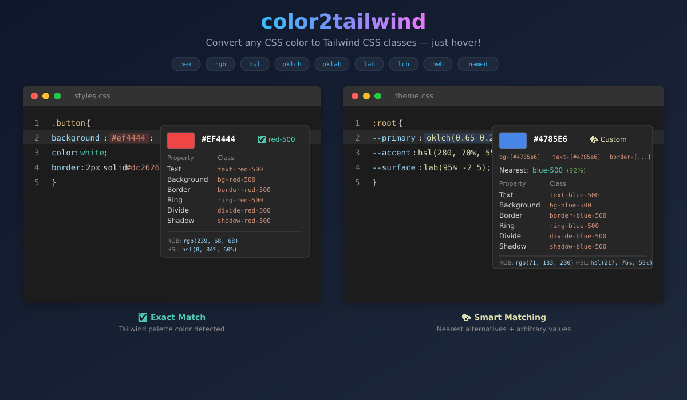

# color2tailwind

[](https://marketplace.visualstudio.com/items?itemName=RutShah.color2tailwind)
[](https://marketplace.visualstudio.com/items?itemName=RutShah.color2tailwind)
[](LICENSE)

> **Convert any CSS color to Tailwind CSS classes** — just hover!

Supports **all modern CSS color formats**: hex, rgb, hsl, hwb, lab, lch, oklch, oklab, and 147 named colors.



---

## ✨ Features

### 🎨 Universal Color Support

Hover over **any CSS color** to instantly see Tailwind equivalents:

```css
/* All of these work! */
.button {
  color: #ef4444; /* Hex */
  background: rgb(59, 130, 246); /* RGB */
  border-color: hsl(262, 83%, 58%); /* HSL */
  box-shadow: 0 0 0 3px oklch(0.7 0.15 200); /* OKLCH */
  outline-color: lab(54% 81 70); /* LAB */
}
```

| Format       | Examples                                     | Status |
| :----------- | :------------------------------------------- | :----: |
| Hex          | `#f00`, `#ef4444`, `#ef444480`               |   ✅   |
| RGB / RGBA   | `rgb(239, 68, 68)`, `rgba(239, 68, 68, 0.5)` |   ✅   |
| HSL / HSLA   | `hsl(0, 84%, 60%)`, `hsl(0 84% 60% / 50%)`   |   ✅   |
| HWB          | `hwb(0 0% 6%)`, `hwb(200 20% 10% / 0.8)`     |   ✅   |
| LAB          | `lab(54% 81 70)`                             |   ✅   |
| LCH          | `lch(54% 107 40)`                            |   ✅   |
| OKLCH        | `oklch(0.63 0.26 29)`                        |   ✅   |
| OKLAB        | `oklab(0.63 0.22 0.13)`                      |   ✅   |
| Named Colors | `red`, `rebeccapurple`, `coral` (147 colors) |   ✅   |

---

### 🎯 Smart Color Matching

#### Exact Match

When your color matches Tailwind's palette exactly:

```
✅ Tailwind CSS Match

Red palette, shade 500

| Property   | Class           |
|:-----------|:----------------|
| Text       | text-red-500    |
| Background | bg-red-500      |
| Border     | border-red-500  |
| Ring       | ring-red-500    |
| Divide     | divide-red-500  |
| Shadow     | shadow-red-500  |
```

#### Nearest Match

For custom colors, find the closest Tailwind alternatives:

```
🎨 Custom Color

Arbitrary values:
| Property   | Class              |
|:-----------|:-------------------|
| Text       | text-[#3fb8c4]     |
| Background | bg-[#3fb8c4]       |
| Border     | border-[#3fb8c4]   |

🔍 Nearest Tailwind Colors

■ cyan-500 — 89% similar (ΔE: 11.2)
■ teal-400 — 85% similar (ΔE: 15.4)
■ sky-500 — 82% similar (ΔE: 18.1)
```

---

### 📋 Quick Convert Command

1. Select any color in your code
2. Open Command Palette (`Ctrl+Shift+P` / `Cmd+Shift+P`)
3. Run **"Convert Color to Tailwind Class"**
4. Pick a class → copied to clipboard!

---

## 🚀 Installation

### From VS Code Marketplace

1. Open **Extensions** (`Ctrl+Shift+X` / `Cmd+Shift+X`)
2. Search **"Color to Tailwind CSS"**
3. Click **Install**

### From VSIX

```bash
code --install-extension color2tailwind-1.1.3.vsix
```

---

## ⚙️ Configuration

| Setting                             | Default | Description                                  |
| :---------------------------------- | :------ | :------------------------------------------- |
| `color2tailwind.showColorPreview`   | `true`  | Show color swatch in hover                   |
| `color2tailwind.showRgbValues`      | `true`  | Display RGB values                           |
| `color2tailwind.showHslValues`      | `true`  | Display HSL values                           |
| `color2tailwind.showOriginalFormat` | `true`  | Show detected format (oklch, lab, etc.)      |
| `color2tailwind.showNearestMatch`   | `true`  | Show nearest Tailwind colors for non-matches |
| `color2tailwind.nearestMatchCount`  | `3`     | Number of nearest colors to display          |
| `color2tailwind.classPrefix`        | `""`    | Prefix for classes (e.g., `tw-`)             |
| `color2tailwind.enabledLanguages`   | `[...]` | Languages where extension is active          |

### Example: Custom Prefix

```json
{
  "color2tailwind.classPrefix": "tw-"
}
```

Result: `tw-bg-red-500` instead of `bg-red-500`

---

## 🎯 Supported Languages

JavaScript, TypeScript, React (JSX/TSX), Vue, Svelte, Astro, HTML, CSS, SCSS, Less, JSON, Markdown, PHP, Blade, ERB, Python

---

## 🧪 Color Science

This extension uses professional color science for accurate matching:

- **Delta E (CIE76)** — Perceptual color difference algorithm
- **LAB Color Space** — Device-independent color representation
- **CSS Color Level 4** — Full spec compliance for modern formats

---

## 🎨 Tailwind Palette

Includes the complete **Tailwind CSS v3** default color palette:

**Grays:** slate, gray, zinc, neutral, stone  
**Colors:** red, orange, amber, yellow, lime, green, emerald, teal, cyan, sky, blue, indigo, violet, purple, fuchsia, pink, rose  
**Special:** black, white

Each color includes shades: **50, 100, 200, 300, 400, 500, 600, 700, 800, 900, 950**

**Total: 242 colors**

---

## 🛠️ Development

```bash
# Clone
git clone https://github.com/rutpshah/color2tailwind.git
cd color2tailwind

# Install & build
npm install
npm run compile

# Debug in VS Code
# Press F5 to launch Extension Development Host
```

### Project Structure

```
color2tailwind/
├── src/
│   ├── colorUtils.ts         # Universal color parser
│   ├── tailwindColors.ts     # Palette + Delta E matching
│   ├── codeActionProvider.ts # Quick copy actions
│   └── extension.ts          # VS Code integration
├── images/
│   └── icon.png
├── package.json
└── README.md
```

---

## 🤝 Contributing

Thanks for your interest in contributing! 🎉

## Ways to Contribute

- 🐛 **Report bugs** - Found something broken? Open an issue
- 💡 **Suggest features** - Have an idea? We'd love to hear it
- 📝 **Improve docs** - Typos, clarifications, examples
- 🔧 **Submit PRs** - Bug fixes, new features, improvements

## Development Setup

```bash
# Clone the repo
git clone https://github.com/rutpshah/color2tailwind.git
cd color2tailwind

# Install dependencies
npm install

# Compile TypeScript
npm run compile

# Watch mode for development
npm run watch
```

## Testing Locally

1. Open the project in VS Code
2. Press `F5` to launch the Extension Development Host
3. Open any file with CSS colors to test hover functionality

## Project Structure

```
color2tailwind/
├── src/
│   ├── extension.ts       # Main extension entry point
│   ├── colorUtils.ts      # Color parsing & conversion
│   └── tailwindColors.ts  # Tailwind palette & matching
├── images/
│   └── icon.png           # Extension icon
├── package.json           # Extension manifest
└── README.md
```

## Pull Request Guidelines

1. **Fork** the repository
2. **Create a branch** for your feature (`git checkout -b feature/amazing-feature`)
3. **Make your changes**
4. **Test** your changes locally
5. **Commit** with a clear message (`git commit -m 'feat: add amazing feature'`)
6. **Push** to your fork (`git push origin feature/amazing-feature`)
7. **Open a Pull Request**

## Commit Message Format

We use conventional commits:

- `feat:` - New feature
- `fix:` - Bug fix
- `docs:` - Documentation only
- `refactor:` - Code change that neither fixes a bug nor adds a feature
- `test:` - Adding or updating tests
- `chore:` - Maintenance tasks

## Code Style

- TypeScript with strict mode
- Use meaningful variable names
- Add comments for complex logic
- Run `npm run lint` before committing

## Adding New Color Formats

To add support for a new color format:

1. Add the regex pattern in `colorUtils.ts`
2. Create a parser function
3. Add conversion to RGBA
4. Update the `parseColor()` function
5. Add tests

## Questions?

Open an issue or start a discussion. We're happy to help!

---

Thank you for contributing! 💜

---

## 📄 License

MIT © [Rut Shah](https://github.com/rutpshah)

---

## 💜 Support

- ⭐ **Star** this repo on [GitHub](https://github.com/rutpshah/color2tailwind)
- 📝 **Review** on the [VS Code Marketplace](https://marketplace.visualstudio.com/items?itemName=RutShah.color2tailwind)
- 🐛 **Report issues** on [GitHub Issues](https://github.com/rutpshah/color2tailwind/issues)

If this extension saves you time, consider:

- ☕ [Buy me a coffee](https://www.buymeacoffee.com/rutpshah)
- [](https://ko-fi.com/rutpshah)

Your support helps me:
- 🔧 Maintain and improve this extension
- 🚀 Build new developer tools
- 📚 Create helpful guides and tutorials

Every coffee fuels late-night coding sessions. Thank you! 🙏

---

**Made with ❤️ for the Tailwind CSS community**
