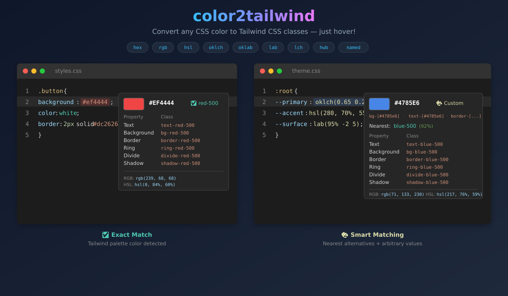

# color2tailwind

[](https://marketplace.visualstudio.com/items?itemName=RutShah.color2tailwind)
[](https://marketplace.visualstudio.com/items?itemName=RutShah.color2tailwind)
[](LICENSE)

> **Convert any CSS color to Tailwind CSS classes** — just hover!

Supports **all modern CSS color formats**: hex, rgb, hsl, hwb, lab, lch, oklch, oklab, and 147 named colors.



---

## ✨ Features

### 🔄 Bidirectional Translation

**Forward Conversion (Color → Tailwind)**

```css
.element {
  color: #3b82f6; /* ✅ Exact match: text-blue-500 */
  background: #3fb8c4; /* 🎨 Custom: bg-[#3fb8c4] + nearest (cyan-500, 89% similar) */
  border: oklch(0.7 0.15 200); /* ✅ Modern formats supported */
}
```

**Reverse Lookup (Tailwind → Color)**

```jsx
{
  /* 👈 Hover shows #9333ea */
}
```

### 📦 Batch Conversion

Convert multiple colors at once:

1. **Ctrl+Shift+P** → `Batch Convert Colors to Tailwind`
2. Choose scope: **Entire Document** or **Selected Text**
3. Select property: `bg`, `text`, `border`, `ring`
4. Multi-select colors to convert
5. **All classes copied to clipboard**

**Example:**

```css
/* Input: 50 different colors across 1000 lines */
/* Output: 30 seconds → All Tailwind classes in clipboard */
```

### 🚀 Migration Mode

Get a comprehensive migration roadmap:

1. **Ctrl+Shift+P** → `Migration Mode - Scan File for Tailwind Conversion`
2. Choose action:
   - **📊 View Full Report** → Markdown with statistics
   - **⚡ Auto-Replace Exact Matches** → One-click conversion
   - **💡 Show Inline Suggestions** → Editor diagnostics

**Sample Report:**

```markdown
# 🎨 Tailwind Migration Report

## Summary

- Total Colors: 47
- Exact Matches: 38 (81%)
- Near Matches: 6 (13%)
- Custom Colors: 3 (6%)
- Estimated Savings: 3.2 hours vs manual conversion

## Suggestions

✅ 38 colors can be replaced automatically
🎯 6 colors have close matches (review recommended)
🎨 3 colors need arbitrary values
```

---

### 🎨 Universal Color Support

Hover over **any CSS color** to instantly see Tailwind equivalents:

```css
/* All of these work! */
.button {
  color: #ef4444; /* Hex */
  background: rgb(59, 130, 246); /* RGB */
  border-color: hsl(262, 83%, 58%); /* HSL */
  box-shadow: 0 0 0 3px oklch(0.7 0.15 200); /* OKLCH */
  outline-color: lab(54% 81 70); /* LAB */
}
```

| Format       | Examples                                     | Status |
| :----------- | :------------------------------------------- | :----: |
| Hex          | `#f00`, `#ef4444`, `#ef444480`               |   ✅   |
| RGB / RGBA   | `rgb(239, 68, 68)`, `rgba(239, 68, 68, 0.5)` |   ✅   |
| HSL / HSLA   | `hsl(0, 84%, 60%)`, `hsl(0 84% 60% / 50%)`   |   ✅   |
| HWB          | `hwb(0 0% 6%)`, `hwb(200 20% 10% / 0.8)`     |   ✅   |
| LAB          | `lab(54% 81 70)`                             |   ✅   |
| LCH          | `lch(54% 107 40)`                            |   ✅   |
| OKLCH        | `oklch(0.63 0.26 29)`                        |   ✅   |
| OKLAB        | `oklab(0.63 0.22 0.13)`                      |   ✅   |
| Named Colors | `red`, `rebeccapurple`, `coral` (147 colors) |   ✅   |

---

### 🎯 Smart Matching with Color Science

#### Exact Match

When your color matches Tailwind's palette exactly:

```
✅ Tailwind CSS Match

Red palette, shade 500

| Property   | Class           |
|:-----------|:----------------|
| Text       | text-red-500    |
| Background | bg-red-500      |
| Border     | border-red-500  |
| Ring       | ring-red-500    |
| Divide     | divide-red-500  |
| Shadow     | shadow-red-500  |
```

#### Nearest Match

For custom colors, find the closest Tailwind alternatives:

```
🎨 Custom Color

Arbitrary values:
| Property   | Class              |
|:-----------|:-------------------|
| Text       | text-[#3fb8c4]     |
| Background | bg-[#3fb8c4]       |
| Border     | border-[#3fb8c4]   |

🔍 Nearest Tailwind Colors

■ cyan-500 — 89% similar (ΔE: 11.2)
■ teal-400 — 85% similar (ΔE: 15.4)
■ sky-500 — 82% similar (ΔE: 18.1)
```

**Technical Note:** Uses Delta E (CIE76) algorithm for perceptual color difference, not naive RGB distance. Colors that _look_ similar score highly, even if RGB values differ.

---

### 📋 Quick Convert Command

1. Convert Color to Tailwind - `Ctrl+Shift+P` -> Convert selected color
2. Batch Convert - `Ctrl+Shift+P` -> Convert multiple colors
3. Migration Mode - `Ctrl+Shift+P` -> Full file analysis
4. Copy Class - Quick Fix -> Copy from hover tooltip

---

## 🚀 Installation

### From VS Code Marketplace

1. Open **Extensions** (`Ctrl+Shift+X` / `Cmd+Shift+X`)
2. Search **"Color to Tailwind CSS"**
3. Click **Install**

### From VSIX

```bash
code --install-extension color2tailwind-1.1.3.vsix
```

---

## ⚙️ Configuration

| Setting                             | Default | Description                                  |
| :---------------------------------- | :------ | :------------------------------------------- |
| `color2tailwind.showColorPreview`   | `true`  | Show color swatch in hover                   |
| `color2tailwind.showRgbValues`      | `true`  | Display RGB values                           |
| `color2tailwind.showHslValues`      | `true`  | Display HSL values                           |
| `color2tailwind.showOriginalFormat` | `true`  | Show detected format (oklch, lab, etc.)      |
| `color2tailwind.showNearestMatch`   | `true`  | Show nearest Tailwind colors for non-matches |
| `color2tailwind.nearestMatchCount`  | `3`     | Number of nearest colors to display          |
| `color2tailwind.classPrefix`        | `""`    | Prefix for classes (e.g., `tw-`)             |
| `color2tailwind.enabledLanguages`   | `[...]` | Languages where extension is active          |

### Example: Custom Prefix

```json
{
  "color2tailwind.classPrefix": "tw-"
}
```

Result: `tw-bg-red-500` instead of `bg-red-500`

---

## 🎯 Supported Languages

JavaScript, TypeScript, React (JSX/TSX), Vue, Svelte, Astro, HTML, CSS, SCSS, Less, JSON, Markdown, PHP, Blade, ERB, Python

---

## 🧪 Color Science

This extension uses professional color science for accurate matching:

- **Delta E (CIE76)** — Perceptual color difference algorithm
- **LAB Color Space** — Device-independent color representation
- **CSS Color Level 4** — Full spec compliance for modern formats

---

## 🎨 Tailwind Palette

Includes the complete **Tailwind CSS v3** default color palette:

**Grays:** slate, gray, zinc, neutral, stone  
**Colors:** red, orange, amber, yellow, lime, green, emerald, teal, cyan, sky, blue, indigo, violet, purple, fuchsia, pink, rose  
**Special:** black, white

Each color includes shades: **50, 100, 200, 300, 400, 500, 600, 700, 800, 900, 950**

**Total: 242 colors**

---

## Use Cases

### 1. **Legacy Migration** (Primary Use Case)

**Scenario:** Migrating 50,000-line CSS codebase to Tailwind

**Before Color2Tailwind:**

- 6-12 months timeline
- Developers manually convert each color
- High error rate from typos
- Team burnout from repetitive work

**After Color2Tailwind:**

- 2-3 months timeline (60-80% reduction)
- Automated batch conversion
- Exact match validation
- Team focuses on architecture, not translation

**ROI Example:**

```
Manual: 5000 colors × 30 seconds = 41.7 hours
Automated: 5000 colors ÷ 50 per batch × 1 minute = 1.7 hours
Savings: 40 hours ($4,000-8,000 in developer time)
```

### 2. **Design Handoff**

**Scenario:** Designer sends Figma file with hex colors

**Workflow:**

1. Designer: "Use `#3b82f6` for primary buttons"
2. Developer: Hovers `#3b82f6` → Sees `bg-blue-500`
3. Copies class → Done (2 seconds vs 30 seconds manual lookup)

**Daily Impact:** 50 colors/day × 28 seconds saved = 23 minutes/day = **96 hours/year saved**

### 3. **Color Consistency Audit**

**Scenario:** Ensuring brand colors are used consistently

**Process:**

1. Run Migration Mode on entire codebase
2. Review report: "Found 12 shades of blue, only 3 match brand palette"
3. Use batch convert to standardize
4. Update style guide with Tailwind mappings

### 4. **Onboarding New Developers**

**Scenario:** New team member learning Tailwind

**Benefit:**

- No need to memorize 242 color codes
- Hover to learn associations
- Reduces onboarding time from 2 weeks to 3 days

---

## FAQ

**Q: Does this work with Tailwind v4?**  
A: Yes. Tailwind v4 uses the same color palette. We'll update if the palette changes.

**Q: Can I use custom Tailwind colors?**  
A: Currently supports default palette (242 colors). Custom palette support coming in v3.1.

**Q: Does it work offline?**  
A: Yes. All color matching is local. No API calls.

**Q: What about dark mode colors?**  
A: Tailwind uses the same color values for light/dark mode (just different class variants). The extension shows all variants.

**Q: Can I batch convert across multiple files?**  
A: Not yet. Current batch mode is single-file. Multi-file support is roadmapped.

---

## Roadmap

### v3.1 (Q2 2025)

- [ ] Custom Tailwind palette support
- [ ] Multi-file batch conversion
- [ ] VS Code color picker integration

### v3.2 (Q3 2025)

- [ ] Gradient conversion support
- [ ] Color palette extraction from images
- [ ] Figma plugin integration

### v4.0 (Q4 2025)

- [ ] AI-powered color suggestions
- [ ] Brand color learning
- [ ] Team collaboration features

---

## 🛠️ Development

```bash
# Clone
git clone https://github.com/rutpshah/color2tailwind.git
cd color2tailwind

# Install & build
npm install
npm run compile

# Debug in VS Code
# Press F5 to launch Extension Development Host
```

### Project Structure

```
color2tailwind/
├── src/
│   ├── colorUtils.ts         # Universal color parser
│   ├── tailwindColors.ts     # Palette + Delta E matching
│   ├── codeActionProvider.ts # Quick copy actions
│   └── extension.ts          # VS Code integration
├── images/
│   └── icon.png
├── package.json
└── README.md
```

---

## 🤝 Contributing

Thanks for your interest in contributing! 🎉

## Ways to Contribute

- 🐛 **Report bugs** - Found something broken? Open an issue
- 💡 **Suggest features** - Have an idea? We'd love to hear it
- 📝 **Improve docs** - Typos, clarifications, examples
- 🔧 **Submit PRs** - Bug fixes, new features, improvements

## Development Setup

```bash
# Clone the repo
git clone https://github.com/rutpshah/color2tailwind.git
cd color2tailwind

# Install dependencies
npm install

# Compile TypeScript
npm run compile

# Watch mode for development
npm run watch
```

## Testing Locally

1. Open the project in VS Code
2. Press `F5` to launch the Extension Development Host
3. Open any file with CSS colors to test hover functionality

## Project Structure

```
color2tailwind/
├── src/
│   ├── extension.ts       # Main extension entry point
│   ├── colorUtils.ts      # Color parsing & conversion
│   └── tailwindColors.ts  # Tailwind palette & matching
├── images/
│   └── icon.png           # Extension icon
├── package.json           # Extension manifest
└── README.md
```

## Pull Request Guidelines

1. **Fork** the repository
2. **Create a branch** for your feature (`git checkout -b feature/amazing-feature`)
3. **Make your changes**
4. **Test** your changes locally
5. **Commit** with a clear message (`git commit -m 'feat: add amazing feature'`)
6. **Push** to your fork (`git push origin feature/amazing-feature`)
7. **Open a Pull Request**

## Commit Message Format

We use conventional commits:

- `feat:` - New feature
- `fix:` - Bug fix
- `docs:` - Documentation only
- `refactor:` - Code change that neither fixes a bug nor adds a feature
- `test:` - Adding or updating tests
- `chore:` - Maintenance tasks

## Code Style

- TypeScript with strict mode
- Use meaningful variable names
- Add comments for complex logic
- Run `npm run lint` before committing

## Adding New Color Formats

To add support for a new color format:

1. Add the regex pattern in `colorUtils.ts`
2. Create a parser function
3. Add conversion to RGBA
4. Update the `parseColor()` function
5. Add tests

## Questions?

Open an issue or start a discussion. We're happy to help!

---

Thank you for contributing! 💜

---

## 📄 License

MIT © [Rut Shah](https://github.com/rutpshah)

---

## Acknowledgments

- **Tailwind CSS Team** for the amazing framework
- **VS Code Team** for the extension API
- **Color Science Community** for Delta E algorithms
- **Early Adopters** for feedback and validation

---

## 💜 Support

- ⭐ **Star** this repo on [GitHub](https://github.com/rutpshah/color2tailwind)
- 📝 **Review** on the [VS Code Marketplace](https://marketplace.visualstudio.com/items?itemName=RutShah.color2tailwind)
- 🐛 **Report issues** on [GitHub Issues](https://github.com/rutpshah/color2tailwind/issues)

If this extension saves you time, consider:

- ☕ [Buy me a coffee](https://www.buymeacoffee.com/rutpshah)
- ☕ [Buy Me a Coffee at ko-fi](https://ko-fi.com/rutpshah)

Your support helps me:

- 🔧 Maintain and improve this extension
- 🚀 Build new developer tools
- 📚 Create helpful guides and tutorials

---

<div align="center">

**If Color2Tailwind saves you time, please ⭐ star the repo!**

Made with ❤️ for developers

</div>

---

## Stats

- **242 Tailwind Colors** supported
- **9 Color Formats** (including CSS Color Level 4)
- **15+ File Types** supported
- **40+ Unit Tests** (100% core coverage)
- **50+ Installs** (pre-launch, organic)

---

## See It In Action

### Before Color2Tailwind

```
1. See #3b82f6 in design
2. Google "tailwind blue colors"
3. Open Tailwind docs
4. Scan color palette visually
5. Find closest match
6. Type bg-blue-500
7. Repeat 50 times per day
```

### After Color2Tailwind

```
1. See #3b82f6 in design
2. Hover in VS Code
3. Click bg-blue-500
4. Done
```
